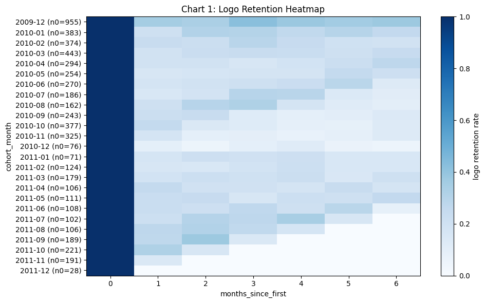
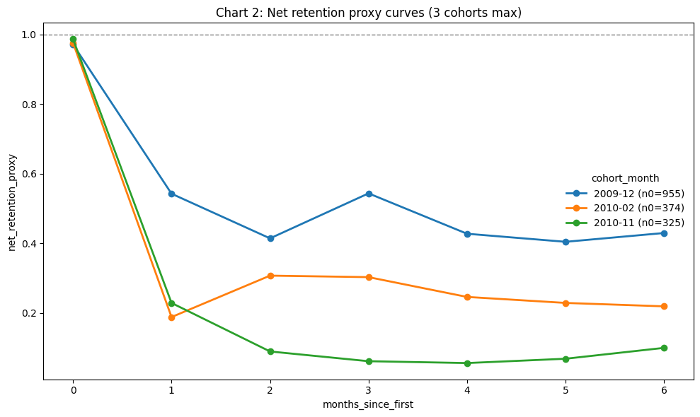
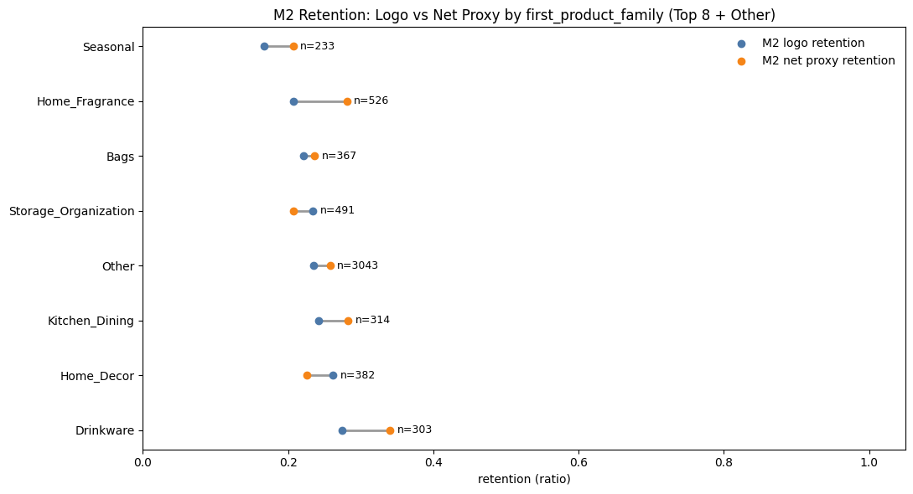

# Cohort Retention Decision Pack (DTC / eCommerce)

## Executive Summary (90-second skim)
- Business question: which first-order families should be prioritized first to improve M2 retention and value quality.
- North Star: `M2 logo retention (cohort-weighted)`.
- Key signal (descriptive): `Seasonal`, `Home_Fragrance`, and `Bags` under-index at M2.
- Decision: prioritize reversible retention tests in those three families with explicit thresholds and guardrails.
- Alpha honesty: this repo is diagnostic + execution planning, not causal attribution.

## Start Here
1. Story PDF: [`exports/cohort_retention_story.pdf`](exports/cohort_retention_story.pdf)
2. Story HTML: [`exports/cohort_retention_story.html`](exports/cohort_retention_story.html)
3. Decision memo: [`docs/DECISION_MEMO_1PAGE.md`](docs/DECISION_MEMO_1PAGE.md)
4. Case study: [`case_study_readme.md`](case_study_readme.md)
5. Expert audit summary: [`docs/EXPERT_UPDATE.md`](docs/EXPERT_UPDATE.md)

## Visual Snapshot




## What You Get
- Story artifacts: `exports/cohort_retention_story.pdf`, `exports/cohort_retention_story.html`
- Decision artifacts: `docs/DECISION_MEMO_1PAGE.md`, `docs/EXPERT_UPDATE.md`
- Governance artifacts: `docs/QA_CHECKLIST.md`, `docs/DRIVER_COVERAGE_REPORT.md`
- Final pack output: `exports/final_decision_pack_v1`
- Public-safe pack output: `exports/public_release_latest.zip`

## One Command: Zero -> Decision Pack
Prerequisites:
- Place raw input at `data_raw/OnlineRetailII.xlsx`
- Install dependencies:
```powershell
py -3 -m venv .venv
.\.venv\Scripts\Activate.ps1
pip install -e .
pip install -e ".[dev]"
```

Run:
```powershell
py -3 scripts/run_zero_to_decision.py --input data_raw/OnlineRetailII.xlsx
```

## Reviewer Checklist
- Verify targets are consistent across story and memo.
- Verify thresholds and guardrails are explicit, numeric, and owner-approved in the memo.
- Verify public artifacts are present and linkable.
- Verify no private/internal assets are referenced in public package.
- Use pack zip as canonical handoff (`exports/public_release_latest.zip`).

## Technical Detail
- Technical appendix: `docs/TECHNICAL_APPENDIX.md`
- Supplementary docs index: `docs/archive/README.md`
